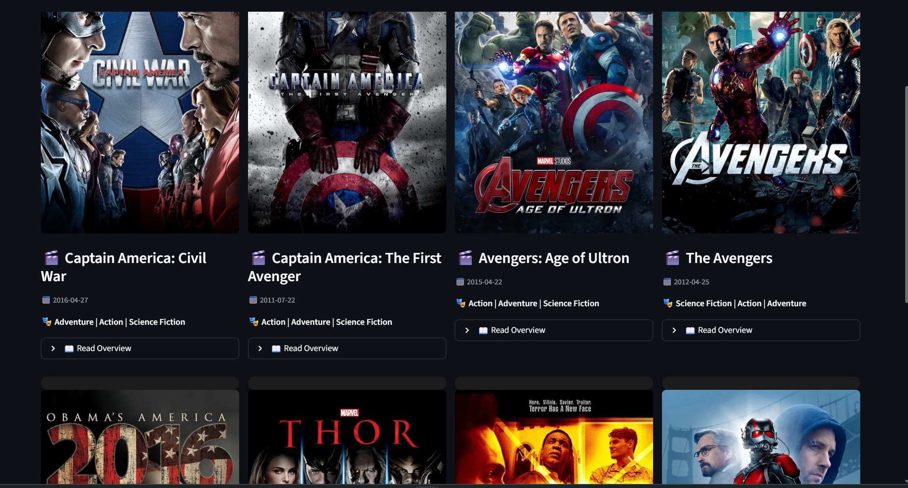

---


# 🎬 Movie Recommender System (Streamlit + TMDB API)

An interactive **Movie Recommendation System** built using **Machine Learning** and **Streamlit**, enhanced with real-time data from the TMDB API.

This app suggests similar movies based on user selection and displays rich details like posters, genres, release date, and overview.

---

## 🚀 Features

✅ Content-based movie recommendation  
✅ Dynamic number of recommendations (5, 10, 15, 20)  
✅ Beautiful Netflix-style UI  
✅ Movie posters from TMDB API  
✅ Expandable movie overview  
✅ Genre & release date display  
✅ Responsive full-width layout  
✅ API loading spinner for better UX  

---

## 🧠 How It Works

The system uses a **Content-Based Filtering approach**:

1. Movies are represented using features like:
   - Genres
   - Keywords
   - Cast
   - Crew

2. These features are combined into a single text representation.

3. Using **vectorization (CountVectorizer)** and **cosine similarity**, we compute similarity scores between movies.

4. Based on the selected movie, the system:
   - Finds similar movies
   - Fetches additional details via TMDB API
   - Displays results in UI

---

## 🏗️ Tech Stack

- **Frontend/UI**: Streamlit  
- **Backend**: Python  
- **Machine Learning**: Scikit-learn  
- **Data Processing**: Pandas, NumPy  
- **API**: TMDB (The Movie Database)  

---

## 📂 Project Structure

```

movie-recommender/
│
├── app.py                  # Main Streamlit app
├── movies.pkl             # Preprocessed movie data
├── similarity.pkl         # Similarity matrix
├── requirements.txt       # Dependencies
├── .streamlit/
│   └── secrets.toml       # API keys (not committed)
└── README.md

````

---

## ⚙️ Setup Instructions

### 1️⃣ Clone the repository

```bash
git clone https://github.com/your-username/movie-recommender.git
cd movie-recommender
````

---

### 2️⃣ Create virtual environment (recommended)

```bash
python -m venv venv
venv\Scripts\activate   # Windows
```

---

### 3️⃣ Install dependencies

```bash
pip install -r requirements.txt
```

---

### 4️⃣ Add TMDB API Key

Create a file:

```
.streamlit/secrets.toml
```

Add:

```toml
TMDB_API_KEY = "your_api_key_here"
```

🔑 Get API key from: [https://www.themoviedb.org/settings/api](https://www.themoviedb.org/settings/api)

---

### 5️⃣ Run the app

```bash
streamlit run app.py
```

---

## 🎯 Usage

1. Select a movie from the dropdown
2. Choose number of recommendations
3. Click **"Recommend"**
4. View results with:

   * Poster 🎞️
   * Title 🎬
   * Release Date 📅
   * Genres 🎭
   * Overview 📖

---

## 📸 Screenshots

> 

> 

---

## ⚡ Performance Optimizations

* API calls cached using `@st.cache_data`
* Reduced UI blocking with loading spinner
* Optimized layout using Streamlit columns

---

## 🔐 Security Best Practices

* API keys stored in `.streamlit/secrets.toml`
* Sensitive files excluded via `.gitignore`

---

## 🚧 Future Enhancements

* 🎥 Movie trailer integration (YouTube)
* ⭐ Ratings & popularity score
* 🤖 AI-based "Why this recommendation?"
* 🔍 Search autocomplete
* 🌐 Deploy on Streamlit Cloud / Azure

---

## 🏆 Use Cases

* Learning ML recommendation systems
* Hackathons & demos
* Portfolio project

---

## 🤝 Contributing

Contributions are welcome!

1. Fork the repo
2. Create a new branch
3. Make changes
4. Submit a PR

---

## 📜 License

This project is open-source and available under the MIT License.

---

## ⭐ Show Your Support

If you like this project, give it a ⭐ on GitHub!

---
